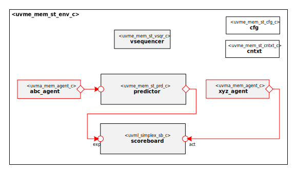

# Datum Technology Corporation Memory Modeling Self-Test UVM Environment
This package contains the Datum Technology Corporation Memory Modeling Self-Test UVM Environment.

# Datum Technology Corporation Memory Modeling Self-Test UVM Environment

# About
This package contains the Datum Technology Corporation Memory Modeling Self-Test UVM Environment.

TODO Describe Memory Modeling

# Block Diagram

# Directory Structure
* `bin` - Scripts, metadata and other miscellaneous files
* `docs` - Documents describing the Datum Technology Corporation Memory Modeling Self-Test UVM Environment
* `examples` - Samples for users
* `src` - Source code for this package

# Dependencies
It is dependent on the following packages:

* `uvm_pkg`
* `uvml_pkg`
* `uvml_logs_pkg`
* TODO Add Memory Modeling dependencies
